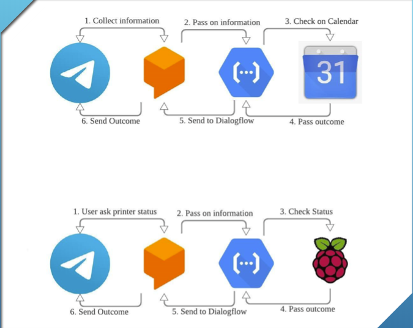
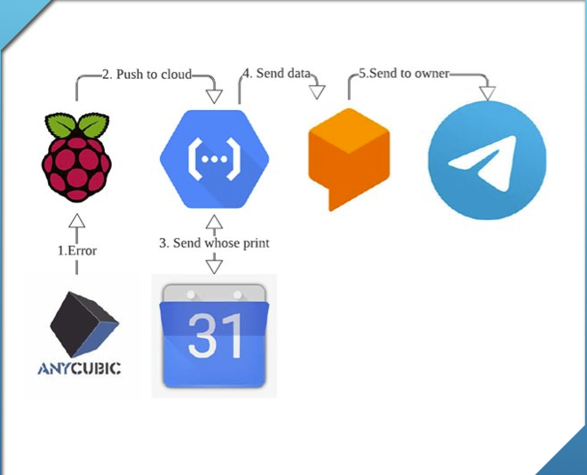

# Project 4dPrinter

<h1>Introduction</h1>

We are a bunch of passionate SUTDents working on our Digital World(10.009) 1D project to make the world a better place by design

List of contributors:

- Tong Hui Xiang @huixiang01 --Kivy
- Wu Xin Yun @0wuxinyun -- Kivy
- Chua Cheng En Alex -- Bot Making and Integration
- Jaryl Lim Yu-Herng @Jaryllim98 -- Bot Making and Integration
- Gerald Wong Chian Hao - Raspberry Pi
- Sarah(Senior) from ASD -- Raspberry Pi

We aim to make our class printer with capabilities to:

1. Checking and detect printer error and send type of printer error to owner
2. Add/Delete/Edit bookings through a telegram bot into google calendar with considering on ownership of print.
3. Send Reminders 30 min before scheduled booking time slot
4. A Personal Kivy phone application dashboard for printer reps
5. (Maybe ) ML algo to predict behaviour of printer users

We also noticed that there are established codes such as OctoPrint that we can potentially utilised on our printer, but due to our course project requirement and customisability, we chose not to wholesale copy over. I hope you find these codes useful. p.s. hopefully FabLab@SUTD will continue allow us to have class printer.

<h1>Architecture</h1>

Scheduling Calendar(2) & Checking Printer Status(1)

Detecting Error(1)

<Put in archi for pt 3 and 4)

<h1>Results</h1>

<work-in-progress>

<h1>Pre-Requisites</h1>

- General Knowledge on Google Cloud Functions
- Basic Python
- Bot-making skills.(If not, users will go nuts on UI. haha)
- 3D printer and raspberry pi (Yup! I am stating the obvious. It is good to make things more clear.)
- Kivy

<h1>Dependencies
</h1>

Welp, sorry to say. Due to kivy, you will have a lot of conflicts and things. We try our best here to document and straighten things out

Currently, we would need:

- Kivy
- kivy.garden
- <work-in-progres>

**note: kivy.garden is a package manager, hence you will need to garden install <package>